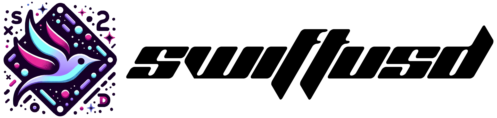
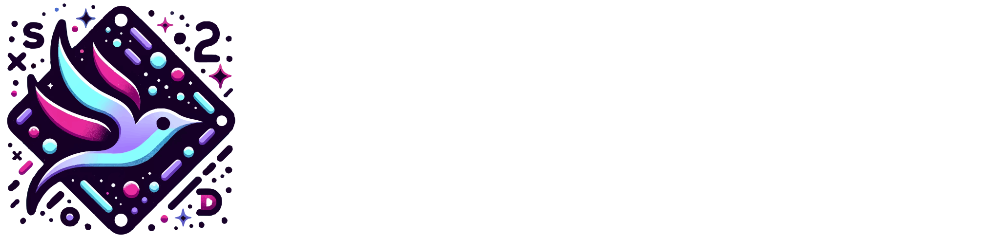

<!-- markdownlint-configure-file {
  "MD013": {
    "code_blocks": false,
    "tables": false
  },
  "MD033": false,
  "MD041": false
} -->

<div align="center">

<h1 align="center">
    <a href="https://wabi.foundation/pixarusd/documentation/pixarusd#gh-light-mode-only">
      
    </a>
    <a href="https://wabi.foundation/pixarusd/documentation/pixarusd#gh-dark-mode-only">
      
    </a>
</h1>

<p align="center">
  <i align="center">Pixar's universal scene description for <b>swift</b> and the open source <b>metaverse</b>.</i>
</p>

</div>

<h4 align="center">
  <a href="https://wabiverse.github.io/SwiftUSD/documentation/pixarusd/">
    
  </a>
  <a href="https://github.com/wabiverse/SwiftUSD/actions/workflows/swift-ubuntu.yml">
    
  </a>
  <a href="https://github.com/wabiverse/SwiftUSD/actions/workflows/swift-macos.yml">
    
  </a>
  <a href="https://github.com/wabiverse/SwiftUSD/graphs/contributors">
    
  </a>
  <br>
  <a href="https://discord.gg/bfW4NyKpuA">
    
  </a>
  <a href="https://wabi.foundation">
    
  </a>
  <a href="https://openusd.org/release/index.html">
    
  </a>
</h4>

<image align=top src="https://www.dropbox.com/scl/fi/cmqz171jkketkvpyojtbx/swiftyusd.png?rlkey=rosui4p7dv410eqvztmynhz56&raw=1">

> [!IMPORTANT]
> #### Supporting SwiftUSD ❤️
> If you find **SwiftUSD** useful, please consider supporting me by [becoming a sponsor](https://github.com/sponsors/wabiverse). I spend a tremendous amount of time dedicating my life to open source projects, and each sponsorship helps me focus more time on making quality tools and software for the community.

<br/>

<div align="center">

# Swifting the Metaverse

</div>

<div align="center">

# 

</div>

Universal Scene Description (**USD**) is an efficient, scalable system for
authoring, reading, and streaming time-sampled scene description for
interchange between graphics applications.

For more details, please visit the web site [here](http://openusd.org).

##### To use Pixar's USD in swift, add SwiftUSD as a package dependency in your project's Package.swift file.
```swift
dependencies: [
  .package(url: "https://github.com/wabiverse/SwiftUSD.git", from: "24.8.0"),
]
```


##### Then, for any target you'd like, add the monolithic USD **Pixar** product as a target dependency, a complete example.
```swift
// swift-tools-version: 5.10
import PackageDescription

let package = Package(
  name: "MyMetaversePackage",
  platforms: [
    .macOS(.v14),
    .visionOS(.v1),
    .iOS(.v17),
    .tvOS(.v17),
    .watchOS(.v10)
  ],
  // --- 📦 Package Products. ---
  products: [
    .library(
      name: "MyMetaverseLibrary",
      targets: ["MyMetaverseLibrary"]
    ),
    .executable(
      name: "MyMetaverseApp",
      targets: ["MyMetaverseApp"]
    ),
  ],
  dependencies: [
    .package(url: "https://github.com/wabiverse/SwiftUSD.git", from: "24.8.0")
  ],
  targets: [
    /* 📕 For library products... */
    .target(
      name: "MyMetaverseLibrary",
      dependencies: [
        /* add pixar usd as a library dependency. */
        .product(name: "PixarUSD", package: "SwiftUSD"),
      ],
      swiftSettings: [
        /* needed for SwiftUSD. */
        .interoperabilityMode(.Cxx)
      ]
    ),

    /* 📗 Or executable products... */
    .executableTarget(
      name: "MyMetaverseApp",
      dependencies: [
        /* add pixar usd as an executable dependency. */
        .product(name: "PixarUSD", package: "SwiftUSD"),
      ],
      swiftSettings: [
        /* needed for SwiftUSD. */
        .interoperabilityMode(.Cxx)
      ],
      plugins: [
        /* 📙 And, plugins are added like so. */
        .plugin(name: "UsdGenSchemaPlugin", package: "SwiftUSD")
      ]
    ),
  ],
  cxxLanguageStandard: .cxx17
)
```

```diff
@@ Dependency Notes @@
- Library Products allow clients that declare a dependency on this package to use the package’s functionality.
+ Executable Products vend an executable target. Use this only if you want to make the executable available to clients.
! Plugin Products vend plugin targets. This makes the plugin available to clients that integrate the Swift package.
# Swift's package manager, SwiftPM, is capabable of building Swift, Objective-C/C++, and C/C++ code.
```

##### Finally, author scene description, this is a working example of creating a new USD stage with a transform and a sphere in swift.
```swift
import Foundation
import PixarUSD

@main
enum Creator
{
  static func main()
  {
    /* Setup all usd resources (python, plugins, resources). */

    Pixar.Bundler.shared.setup(.resources)

    /* Create a new USD stage with a transform and a sphere. */

    let stage = Usd.Stage.createNew("HelloPixarUSD.usda")

    UsdGeom.Xform.define(stage, path: "/Hello")
    UsdGeom.Sphere.define(stage, path: "/Hello/World")

    stage.getPseudoRoot().set(doc: "Hello World Example (Swift)!")

    stage.save()
  }
}
```

##### Or, if you prefer those swifty declarative APIs...
```swift
import Foundation
import PixarUSD

@main
enum Creator
{
  static func main()
  {
    /* Setup all usd resources (python, plugins, resources). */

    Pixar.Bundler.shared.setup(.resources)

    /* Create a new USD stage with a transform and a sphere. */

    USDStage("HelloPixarUSD", ext: .usda)
    {
      USDPrim("Hello", type: .xform)
      {
        USDPrim("World", type: .sphere)
      }
    }
    .set(doc: "Stay Swifty.")
    .save()
  }
}
```

<br/>

# **UsdView (Under Development)**

  The **UsdView** application in this project is written entirely in **Swift**, and serves as a living example of both **Swift/C++** interop
  and creating **cross platform UI** applications in **Swift** (utilizing [**SwiftCrossUI**](https://github.com/stackotter/swift-cross-ui)).

  ### Linux

  > [!IMPORTANT]
  > The [**bundler**](https://github.com/stackotter/swift-bundler.git) is currently in development to support bundling apps on **Linux**, until then please follow these instructions to run **UsdView** on **Linux**:

<div align="center">

  <div align="left">

  ```pwsh
  git clone https://github.com/wabiverse/SwiftUSD
  cd SwiftUSD

  swift run -c release UsdView
  ```

  </div>

</div>

  ### Apple Devices (macOS, visionOS, iOS)

  > [!TIP]
  > Install the [**bundler**](https://github.com/stackotter/swift-bundler.git) locally by running the following commands in your terminal:

<div align="center">

  <div align="left">

  ```pwsh
  git clone https://github.com/stackotter/swift-bundler
  cd swift-bundler

  swift build -c release
  sudo cp .build/release/swift-bundler /usr/local/bin/
  ```

  </div>


  <div align="left">

  Finally, to run and bundle **UsdView** or any other app (such as your own!) with the bundler installed locally, run the following commands:
  ```pwsh
  git clone https://github.com/wabiverse/SwiftUSD
  cd SwiftUSD
  ```

  #### **macOS**

  Run and bundle **UsdView** on **macOS**.
  ```pwsh
  swift bundler run -c release UsdView
  ```

  #### **visionOS** or **iOS**

  Run and bundle **UsdView** on **visionOS** or **iOS**.
  ```pwsh
  # list available iOS and visionOS simulators.
  swift bundler simulators

  # boot a simulator from the list.
  swift bundler simulators boot [id-of-device]

  # if you booted a visionOS device.
  swift bundler run -p visionOSSimulator -c release UsdView

  # if you booted a iOS device.
  swift bundler run -p iOSSimulator -c release UsdView
  ```

  </div>

</div>

<br/>

# **OH SH!**
You can even run it in a tiny script, no package necessary, the comments next to the import
statements describe the git sources to pull from, and everything transitively linked will come flying
on in - checkout [**swift-sh**](https://github.com/mxcl/swift-sh)!

> [!IMPORTANT]
> You will need to use the **Wabi** [**fork of swift-sh**](https://github.com/wabiverse/swift-sh)
> in order for this to work with **Swift 5.9** cxx interop.


<br>

> [!NOTE]
> Swift is an open source programming language that is fully supported across **Linux** and [**Swift on Server**](https://www.swift.org/server/), the entire **Apple** family of devices: **macOS**, **visionOS**, **iOS**, **tvOS**, **watchOS**, as well as support for **Microsoft Windows**. To learn more about Swift, please visit [swift.org](https://www.swift.org).

<br>

<hr/>

###### *if you can `mmap` a **pixel**, you can `mmap` a **metaverse**.*
###### SwiftUSD is licensed under the terms of the [Tomorrow Open Source Technology 1.0 License](https://openusd.org/license).
